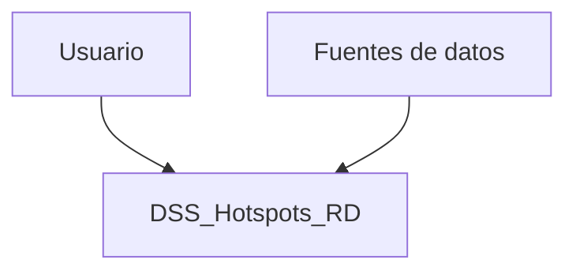
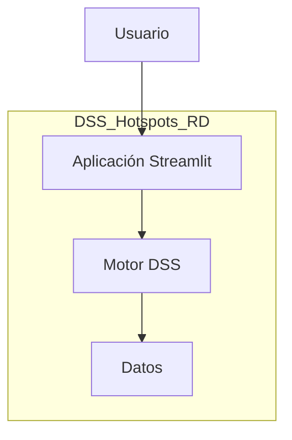
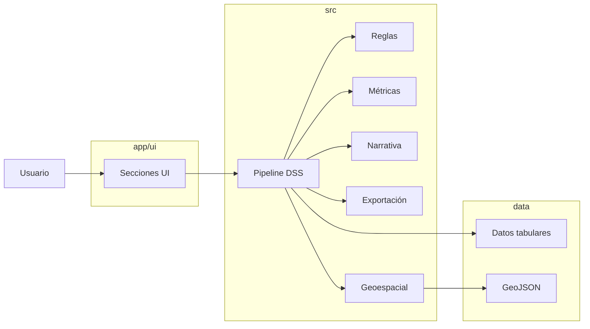

# DSS_Hotspots_RD


Sistema de Soporte a la Decisión (DSS) para la identificación, priorización y análisis de hotspots de accidentes de tránsito en la República Dominicana.

---

## Autor
**Edwin José Nolasco**

---

## Resumen Ejecutivo

DSS_Hotspots_RD es un sistema diseñado para apoyar la toma de decisiones en seguridad vial mediante la identificación de territorios críticos (hotspots) de siniestralidad.

El sistema transforma datos históricos en **priorización accionable**, permitiendo responder preguntas clave:

- ¿Dónde intervenir primero?
- ¿Qué provincias presentan mayor criticidad relativa?
- ¿Cómo optimizar recursos limitados?

El DSS no solo describe la situación, sino que **estructura decisiones mediante ranking, reglas y narrativa automatizada**.

---

## Descripción del sistema

El proyecto implementa un DSS híbrido que integra:

- Procesamiento y validación de datos territoriales
- Ingeniería de características
- Modelos predictivos (Machine Learning)
- Reglas de decisión DSS
- Métricas de priorización Top-K
- Visualización geoespacial interactiva
- Generación automática de resumen ejecutivo
- Exportación profesional de resultados

---

## Propuesta de valor

A diferencia de dashboards tradicionales:

- Prioriza decisiones, no solo visualiza datos
- Integra analítica + reglas + narrativa (enfoque DSS completo)
- Implementa lógica Top-K para escenarios reales de intervención
- Ofrece doble interfaz: analítica y ejecutiva

---

## Modos de uso

### 🔬 Modo Analítico
- Exploración completa de datos
- Métricas detalladas
- Validación y trazabilidad del DSS

### 📊 Modo Presentación (Ejecutivo)
- Resumen ejecutivo automático
- KPIs clave
- Top-N provincias prioritarias
- Mapa limpio
- Recomendación DSS directa

---

## Arquitectura del sistema

El sistema sigue una arquitectura modular desacoplada:

- `app/` → capa de presentación (Streamlit + UI modular)
- `src/` → motor DSS (pipeline, reglas, métricas, narrativa)
- `data/` → datos tabulares y geoespaciales
- `scripts/` → utilidades de transformación

Esta separación permite evolución independiente de la interfaz y del núcleo analítico.

---

## Diagrama de arquitectura (C4)

### Nivel 1 — Contexto



### Nivel 2 — Contenedores



### Nivel 3 — Componentes



---

## Flujo DSS

1. Ingesta de datos
2. Validación y normalización territorial
3. Ingeniería de características
4. Construcción de métricas de criticidad
5. Generación de ranking territorial
6. Aplicación de reglas DSS
7. Visualización y narrativa
8. Exportación de resultados

---

## Enfoque Top-K (Formalización)

El sistema adopta un enfoque Top-K para priorización territorial.

Dado un conjunto de provincias \( P = {p_1, p_2, ..., p_n} \) y una función de criticidad \( f(p) \), se define:

- Ranking: ordenar \( P \) en función de \( f(p) \)
- Selección: elegir los \( K \) elementos con mayor criticidad

### Métricas implementadas

- **HitRate@K**: mide si los verdaderos hotspots están dentro del Top-K
- **nDCG@K (Normalized Discounted Cumulative Gain)**:
  - Evalúa calidad del ranking considerando posición
  - Penaliza errores en ordenamiento

Este enfoque es consistente con escenarios donde los recursos de intervención son limitados y se requiere priorización efectiva.

---

## Estructura del repositorio

```bash
DSS_Hotspots_RD/
├── .github/        # CI/CD
├── app/            # Aplicación y UI
├── src/            # Motor DSS
├── data/           # Datos y geodatos
├── scripts/        # Utilidades
├── README.md
├── CHANGELOG.md
├── VERSION
└── requirements.txt
```

---

## Instalación

```bash
git clone https://github.com/edjnolasco/dss_hotspots_rd.git
cd dss_hotspots_rd
pip install -r requirements.txt
```

---

## Ejecución

```bash
streamlit run app/app.py
```

---

## Calidad del proyecto

- Pruebas unitarias (pytest)
- Coverage >= 80%
- Linting con Ruff
- CI/CD con GitHub Actions
- Arquitectura modular desacoplada

---

## Roadmap

- Modelos avanzados (SVM, ensembles)
- Explicabilidad (XAI)
- Series temporales
- Integración con datos en tiempo real
- Despliegue productivo

---

## Licencia

MIT License
